# Audit E2E, Visual, dan Alur Bisnis

**Proyek:** Village Service Management  
**Tanggal audit:** 6 Agustus 2026  
**Status dokumen:** Aktif — menjadi daftar kerja QA dan gap  
**Audit run final:** `2026-08-06T12-49-18Z`  
**Pemilik tindak lanjut:** Tim pengembang aplikasi

## 1. Tujuan dokumen

Dokumen ini menjadi sumber tunggal untuk:

1. mencatat hasil pengujian end-to-end dan visual;
2. menjelaskan alur bisnis yang benar dengan diagram Mermaid;
3. menyimpan bug, kejanggalan, risiko, dan area yang belum diuji;
4. memprioritaskan penyelesaian satu per satu; dan
5. mencatat hasil retest setelah perbaikan.

Status temuan yang digunakan:

- `OPEN`: belum diperbaiki;
- `IN PROGRESS`: sedang dikerjakan;
- `READY FOR RETEST`: perbaikan selesai, belum diverifikasi;
- `RESOLVED`: retest lulus;
- `ACCEPTED RISK`: dipahami dan diterima tanpa perubahan;
- `BLOCKED`: membutuhkan keputusan atau layanan eksternal.

## 2. Lingkungan dan metode audit

### 2.1 Lingkungan

- Laravel 13.8 / PHP 8.5 saat audit lokal.
- Database audit: SQLite terpisah di `storage/app/e2e-audit.sqlite`.
- Server audit: `http://127.0.0.1:8010`.
- Browser: Chromium/Google Chrome headless melalui Playwright.
- Akun: `admin@desa.test` dengan role Super Admin.
- Viewport:
  - mobile: 320 × 720;
  - tablet: 768 × 900;
  - laptop: 1024 × 768;
  - desktop: 1440 × 900.

Database development utama tidak digunakan. Private storage masih memakai disk proyek yang sama; artefak pengajuan audit final telah dibersihkan setelah pengujian. Isolasi filesystem penuh masih menjadi gap `GAP-009`.

### 2.2 Artefak

- Script reproducible: `tests/e2e/full-system-audit.mjs`
- Perintah: `npm run test:e2e:audit`
- Exit code run final: `1`, sesuai sepuluh flow yang menemukan bug produk terbuka.
- Laporan JSON: `storage/app/private/full-system-audit/2026-08-06T12-49-18Z/report.json`
- Ringkasan JSON: `storage/app/private/full-system-audit/2026-08-06T12-49-18Z/summary.json`
- Screenshot: folder run yang sama, sebanyak 168 file PNG.
- Database audit: `storage/app/e2e-audit.sqlite`

### 2.3 Pemeriksaan otomatis per halaman

Setiap halaman diperiksa untuk:

- status HTTP;
- horizontal overflow;
- jumlah elemen `h1`;
- ID HTML duplikat;
- kontrol interaktif tanpa accessible name;
- gambar rusak;
- warning/error console;
- uncaught JavaScript error;
- indikasi mojibake/encoding rusak; dan
- screenshot full-page.

Pemeriksaan ini bukan pengganti audit WCAG lengkap dengan axe-core atau screen reader.

### 2.4 Cara menjalankan ulang

Jangan menjalankan `migrate:fresh` terhadap database development. Gunakan database audit eksplisit:

```powershell
$auditDb = Join-Path (Resolve-Path 'storage/app') 'e2e-audit.sqlite'
if (-not (Test-Path -LiteralPath $auditDb)) {
    New-Item -ItemType File -Path $auditDb
}
$env:APP_ENV = 'testing'
$env:DB_CONNECTION = 'sqlite'
$env:DB_DATABASE = $auditDb
$env:CACHE_STORE = 'array'
$env:SESSION_DRIVER = 'file'
$env:QUEUE_CONNECTION = 'sync'
php artisan migrate:fresh --seed --force
php artisan serve --host=127.0.0.1 --port=8010
```

Biarkan server berjalan. Di terminal kedua:

```powershell
$env:APP_URL = 'http://127.0.0.1:8010'
npm run test:e2e:audit
```

Exit code non-zero berarti ada flow bisnis gagal. Baca `summary.json` dan `report.json` pada folder run terbaru sebelum menyimpulkan penyebabnya.

## 3. Ringkasan hasil

| Area | Diperiksa | Lulus | Gagal/flag |
|---|---:|---:|---:|
| Flow interaktif | 15 | 5 | 10 |
| Render halaman | 168 | 165 | 3 |
| Screenshot | 168 | 168 dibuat | 0 gagal dibuat |
| Status HTTP halaman visual | 168 | 168 | 0 |
| Console/page error | 168 | 168 bersih | 0 |
| Broken image | 168 | 168 bersih | 0 |
| Duplicate DOM ID | 168 | 168 bersih | 0 |
| Accessible name dasar | 168 | 168 bersih | 0 |
| Struktur satu `h1` | 168 | 168 | 0 |

Quality gate tambahan:

- PHPUnit: 46 test, 287 assertion, seluruhnya lulus.
- Vite production build: lulus.
- `node --check tests/e2e/full-system-audit.mjs`: lulus.
- Vite memberi warning satu chunk lebih besar dari 500 kB; lihat `GAP-016`.

Kesimpulan:

- Flow inti layanan warga dari pengajuan sampai dokumen diunduh **lulus**.
- Import penduduk dengan preview dan konfirmasi **lulus**.
- Builder dokumen add–inspect–delete **lulus**.
- Create dan delete pada sembilan CRUD generik **berhasil**, tetapi semua halaman edit mengembalikan HTTP 500.
- Field telepon yang seharusnya opsional tidak bisa dibiarkan kosong.
- Ada tiga masalah horizontal overflow pada breakpoint tertentu.
- Visual audit mencakup 42 tipe halaman × 4 viewport.

## 4. Matriks pengujian E2E

| ID | Flow | Hasil | Bukti/catatan |
|---|---|---|---|
| E2E-001 | Guard admin, login gagal, login berhasil | PASS | Tamu diarahkan ke login; kredensial salah menampilkan error; login benar membuka dashboard. |
| E2E-002 | Warga mengirim pengajuan dan mengecek status | PASS | Pengajuan dibuat, kode `REQ-*` tampil, dan status dapat ditemukan dengan kode + NIK. |
| E2E-003 | Admin filter, verifikasi, publish, warga download | PASS | PDF otomatis dibuat dan unduhan warga berhasil. |
| E2E-004 | Import penduduk preview → konfirmasi → export/template | PASS | Tepat satu input file; import satu baris; export CSV dan template XLSX HTTP 200. |
| E2E-005 | CRUD Profil Desa | FAIL | Create dan delete berhasil; halaman edit HTTP 500. |
| E2E-006 | CRUD Kartu Keluarga | FAIL | Create dan delete berhasil; halaman edit HTTP 500. |
| E2E-007 | CRUD Penduduk | FAIL | Create dan delete berhasil; halaman edit HTTP 500. |
| E2E-008 | CRUD Jenis Layanan | FAIL | Create dan delete berhasil; halaman edit HTTP 500. |
| E2E-009 | CRUD Syarat Layanan | FAIL | Create dan delete berhasil; halaman edit HTTP 500. |
| E2E-010 | CRUD Field Layanan | FAIL | Create dan delete berhasil; halaman edit HTTP 500. |
| E2E-011 | CRUD Pengumuman | FAIL | Create dan delete berhasil; halaman edit HTTP 500. |
| E2E-012 | CRUD User | FAIL | Create dan delete berhasil; halaman edit HTTP 500. |
| E2E-013 | CRUD Role | FAIL | Create dan delete berhasil; halaman edit HTTP 500. |
| E2E-014 | Telepon opsional dibiarkan kosong | FAIL | JavaScript mengirim `+62`; backend menolak karena tidak memenuhi regex nomor telepon. |
| E2E-015 | Builder dokumen add–inspect–delete | PASS | Jumlah field kembali ke kondisi awal dan inspector aktif ketika field dipilih. |

## 5. Hasil visual

### 5.1 Halaman yang ter-flag

| ID | Halaman | Viewport | Masalah | Screenshot |
|---|---|---|---|---|
| VIS-001 | Detail pengajuan admin | Mobile 320 px | Tabel artefak memaksa dokumen melebar jauh di luar viewport. | `017-admin-request-detail-mobile.png` |
| VIS-002 | Data Penduduk | Laptop 1024 px | Tabel generik keluar dari lebar konten. | `106-admin-residents-laptop.png` |
| VIS-003 | Template Dokumen | Laptop 1024 px | Tabel template keluar dari lebar konten. | `120-admin-document-templates-laptop.png` |

### 5.2 Halaman yang diperiksa

Baseline mencakup:

- portal publik, daftar layanan, lima detail layanan, lima form pengajuan;
- cek status dan login;
- dashboard admin dan daftar/detail pengajuan;
- index dan create untuk sembilan resource CRUD;
- daftar, create, dan builder template dokumen;
- activity log, security log, notification log;
- halaman WhatsApp; dan
- seluruh halaman di empat viewport.

### 5.3 Batas visual test saat ini

- Screenshot sudah tersedia sebagai baseline bukti.
- Belum ada pembandingan pixel otomatis dengan baseline yang disetujui.
- Belum ada toleransi diff, masking timestamp, atau approval workflow snapshot.
- Pemeriksaan visual manual dilakukan pada semua screenshot ter-flag dan sampel representatif.

## 6. Daftar temuan dan gap

### GAP-001 — Semua halaman edit CRUD generik HTTP 500

- **Status:** OPEN
- **Severity:** Critical
- **Dampak:** Sembilan resource master tidak dapat diedit dari UI.
- **Terpengaruh:** profil desa, kartu keluarga, penduduk, jenis layanan, syarat layanan, field layanan, pengumuman, user, role.
- **Bukti runtime:** seluruh E2E-005 sampai E2E-013 gagal pada halaman edit.
- **Root cause terverifikasi:** route mengirim parameter `{id}` lalu default `resource`, sedangkan signature controller mendeklarasikan `edit(string $resource, int $id)`. Dispatcher memanggil contoh `edit('2', 'users')`, lalu strict type menghasilkan `TypeError`.
- **Anchor kode:** `routes/web.php:99`, `app/Http/Controllers/Admin/AdminCrudController.php:72`.
- **Perbaikan yang disarankan:** ubah signature agar urutan parameter sesuai dispatcher, kemudian tambah regression test GET edit untuk seluruh resource.
- **Kriteria selesai:** semua sembilan halaman edit HTTP 200 dan update E2E lulus.

### GAP-002 — Field telepon nullable berubah menjadi `+62`

- **Status:** OPEN
- **Severity:** High
- **Dampak:** Profil desa, penduduk, atau user dengan nomor telepon kosong tidak dapat disimpan melalui UI.
- **Bukti runtime:** E2E-014 gagal.
- **Root cause terverifikasi:** `sanitizePhoneInput()` selalu menggabungkan kode negara dan nilai lokal, termasuk saat nilai lokal kosong. Hidden input menjadi `+62`, sedangkan backend mengizinkan `nullable` tetapi jika terisi mewajibkan 7–18 digit.
- **Anchor kode:** `resources/js/app.js:63-72`, `resources/views/admin/crud/partials/field.blade.php:18-26`, `app/Http/Controllers/Admin/AdminCrudController.php:157-163`.
- **Perbaikan yang disarankan:** set hidden value ke string kosong ketika nomor lokal kosong; tambah browser test untuk create/edit tanpa telepon.
- **Kriteria selesai:** form tanpa nomor telepon tersimpan dan database menyimpan `null`.

### GAP-003 — Detail pengajuan overflow pada mobile

- **Status:** OPEN
- **Severity:** High
- **Dampak:** Pengguna admin harus scroll horizontal; bagian halaman terlihat seperti desktop yang dipaksa masuk mobile.
- **Bukti:** VIS-001.
- **Area kode:** tabel artefak di `resources/views/admin/service-requests/show.blade.php:35`; responsive grid di `resources/css/app.css:277,422`.
- **Perbaikan yang disarankan:** jadikan tabel card/list pada mobile atau beri wrapper scroll yang benar tanpa memperlebar body.
- **Kriteria selesai:** `documentElement.scrollWidth <= clientWidth` pada 320 px.

### GAP-004 — Tabel penduduk overflow pada laptop

- **Status:** OPEN
- **Severity:** Medium
- **Dampak:** Kolom aksi dan bagian tabel keluar dari card pada 1024 px.
- **Bukti:** VIS-002.
- **Root cause terindikasi:** tabel generic di `resources/views/admin/crud/index.blade.php:84` tidak dibungkus container horizontal scroll.
- **Perbaikan yang disarankan:** gunakan wrapper `.table-scroll`/`.table-wrap` yang menetapkan `overflow-x:auto`, atau ubah menjadi responsive table/card.
- **Kriteria selesai:** tidak ada body-level overflow pada 1024 px.

### GAP-005 — Tabel template dokumen overflow pada laptop

- **Status:** OPEN
- **Severity:** Medium
- **Dampak:** Kolom terakhir keluar dari card pada 1024 px.
- **Bukti:** VIS-003.
- **Area kode:** `resources/views/admin/document-templates/index.blade.php:4`.
- **Perbaikan yang disarankan:** pastikan `.table-wrap` benar-benar memiliki `overflow-x:auto` dan child table tidak memperlebar body.
- **Kriteria selesai:** tidak ada body-level overflow pada 1024 px.

### GAP-006 — Role tidak memiliki UI pengaturan permission

- **Status:** OPEN
- **Severity:** High
- **Dampak:** Role baru dapat dibuat, tetapi tidak ada flow admin untuk memilih atau menyinkronkan permission.
- **Bukti kode:** CRUD role hanya mengekspos `name` dan `guard_name`; `syncRole()` hanya menangani role milik user.
- **Area kode:** `app/Http/Controllers/Admin/AdminCrudController.php`.
- **Perbaikan yang disarankan:** tambahkan multi-select permission, validasi, dan `syncPermissions()`.
- **Kriteria selesai:** admin dapat membuat/edit role dengan permission dan RBAC test membuktikan hasilnya.

### GAP-007 — Foreign key dan enum penting dirender sebagai text input

- **Status:** OPEN
- **Severity:** Medium
- **Dampak:** Admin harus mengetahui ID database dan nilai teknis seperti `male`, tipe field, atau role; rawan salah input.
- **Contoh:** `family_card_id`, `service_type_id`, `gender`, `field_type`, dan `role`.
- **Bukti kode:** fallback input generik di `resources/views/admin/crud/partials/field.blade.php`.
- **Perbaikan yang disarankan:** select/searchable lookup dengan label manusia dan pilihan enum tervalidasi.
- **Kriteria selesai:** tidak ada foreign key bisnis yang meminta raw numeric ID.

### GAP-008 — CI belum menjalankan frontend build, E2E, atau visual audit

- **Status:** OPEN
- **Severity:** High
- **Dampak:** Bug UI/runtime dapat lolos walaupun PHPUnit dan Pint hijau.
- **Bukti:** `.github/workflows/ci.yml` hanya menjalankan Composer, migration, PHPUnit, dan Pint.
- **Perbaikan yang disarankan:** tambah Node setup, `npm ci`, `npm run build`, dan E2E smoke yang memakai SQLite terisolasi; visual diff dapat menjadi job terpisah.
- **Kriteria selesai:** pull request gagal ketika flow kritis atau build frontend gagal.

### GAP-009 — Filesystem E2E belum sepenuhnya terisolasi

- **Status:** OPEN
- **Severity:** Medium
- **Dampak:** Database audit terpisah, tetapi template, upload, dan dokumen hasil audit memakai root private storage aplikasi.
- **Perbaikan yang disarankan:** buat disk `private_testing` atau izinkan root `private` dioverride melalui environment.
- **Kriteria selesai:** seluruh file E2E ditulis ke folder run dan dapat dibersihkan atomik.

### GAP-010 — WhatsApp belum diuji dengan perangkat nyata

- **Status:** BLOCKED
- **Severity:** High
- **Dampak:** Pairing QR, reconnect, dan pengiriman nyata belum terbukti.
- **Yang sudah terbukti:** halaman WhatsApp render tanpa error; feature test mem-fake respons bridge dan membuktikan pembuatan notification log.
- **Yang belum terbukti:** scan QR, sesi persisten, pengiriman ke nomor nyata, retry setelah bridge mati.
- **Kebutuhan:** perangkat WhatsApp test dan izin menjalankan bridge lokal/staging.
- **Kriteria selesai:** pesan status diterima perangkat test dan notification log cocok dengan delivery result.

### GAP-011 — Cabang reject, upload manual, dan regenerate belum diuji browser penuh

- **Status:** OPEN
- **Severity:** Medium
- **Dampak:** Jalur alternatif dokumen belum memiliki bukti E2E browser setara jalur publish otomatis.
- **Yang sudah ada:** feature/integration tests untuk status guard, invalid PDF, manual document, dan generation.
- **Perbaikan yang disarankan:** tambah tiga browser flow terisolasi: reject, manual upload+complete, regenerate dengan reason.

### GAP-012 — Backup hanya diuji create, belum restore drill

- **Status:** OPEN
- **Severity:** High
- **Dampak:** Adanya arsip tidak membuktikan data dapat dipulihkan.
- **Bukti yang ada:** PHPUnit menguji command backup menghasilkan arsip private.
- **Perbaikan yang disarankan:** prosedur restore ke database kosong, checksum, dan verifikasi record/storage.

### GAP-013 — Belum ada visual regression diff

- **Status:** OPEN
- **Severity:** Medium
- **Dampak:** Screenshot run tersedia, tetapi perubahan visual antar commit belum otomatis terdeteksi.
- **Perbaikan yang disarankan:** baseline versioned atau artifact CI dengan approval, masking timestamp, dan threshold diff.

### GAP-014 — Audit aksesibilitas masih dasar

- **Status:** OPEN
- **Severity:** Medium
- **Dampak:** Label dasar bersih, tetapi contrast, focus order, landmark, ARIA state, dan screen-reader behavior belum diaudit penuh.
- **Perbaikan yang disarankan:** axe-core di Playwright, keyboard-only pass, dan minimal satu screen-reader review manual.

### GAP-015 — Coverage test tidak diukur

- **Status:** OPEN
- **Severity:** Low
- **Dampak:** 46 test lulus, tetapi tidak ada angka line/branch coverage untuk menemukan logic yang tidak tersentuh.
- **Perbaikan yang disarankan:** aktifkan PCOV/Xdebug di job coverage dan tetapkan baseline, bukan target arbitrer.

### GAP-016 — Bundle document builder melewati warning 500 kB

- **Status:** OPEN
- **Severity:** Low
- **Dampak:** Initial load builder dapat lebih berat pada perangkat atau jaringan lambat.
- **Bukti build:** `document-builder-*.js` sekitar 536 kB sebelum gzip; Vite memberi chunk-size warning.
- **Catatan:** builder sudah di-load dinamis dari `app.js`, sehingga dampak terutama terbatas pada halaman builder.
- **Perbaikan yang disarankan:** ukur LCP/INP halaman builder terlebih dahulu, lalu evaluasi split PDF.js/editor bila hasil ukur memang bermasalah.

## 7. Diagram alur bisnis

### 7.1 Autentikasi dan otorisasi admin

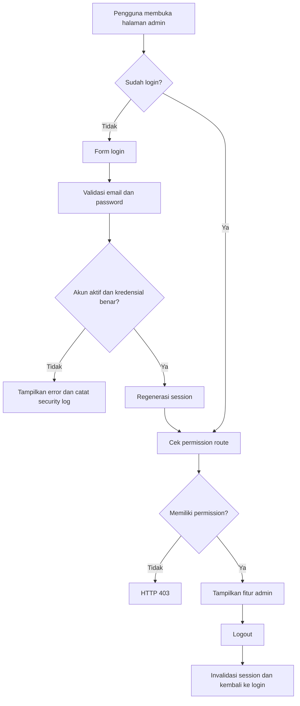

### 7.2 Warga memilih layanan

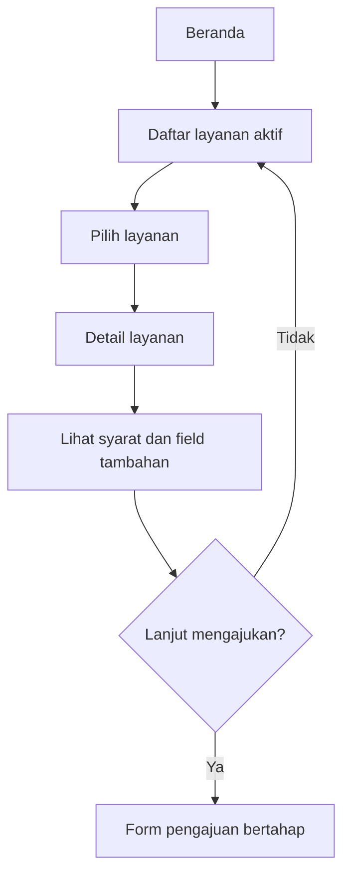

### 7.3 Pengajuan layanan warga

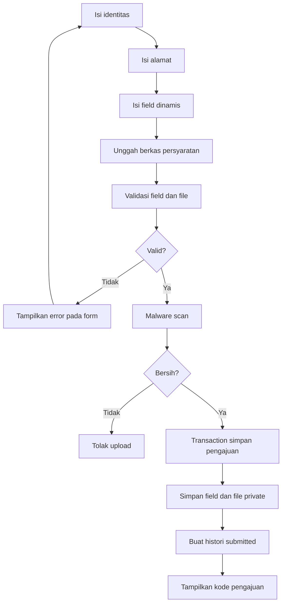

### 7.4 Pemeriksaan status oleh warga

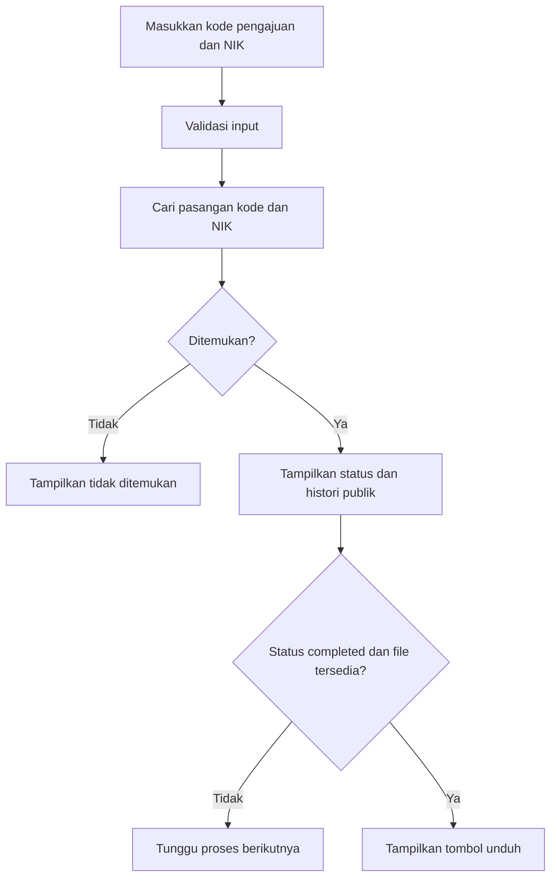

### 7.5 Verifikasi dan penerbitan otomatis

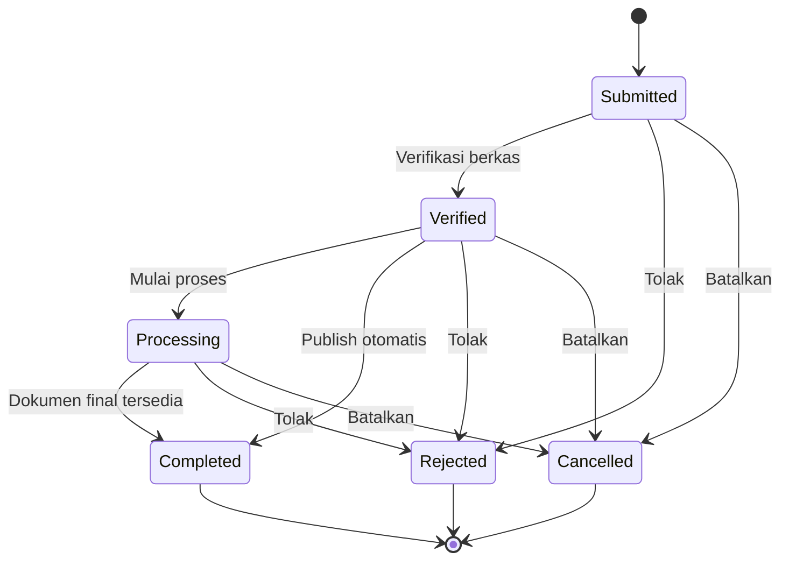

### 7.6 Pembuatan dokumen final

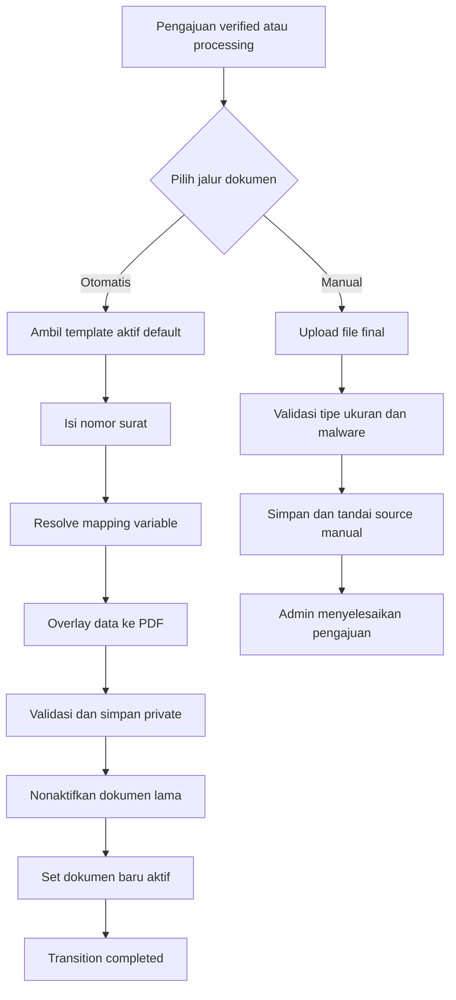

### 7.7 Unduh dokumen warga

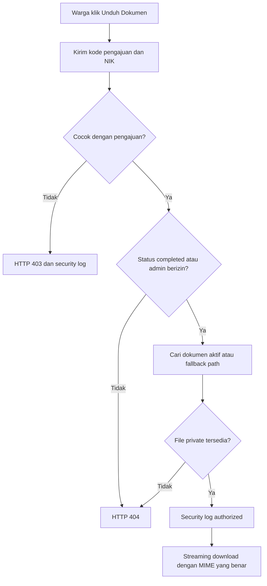

### 7.8 Import dan export penduduk

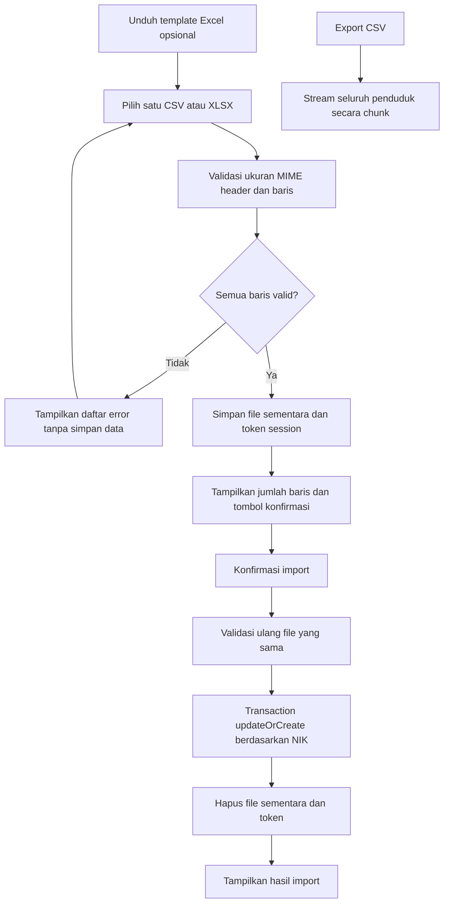

### 7.9 CRUD data master

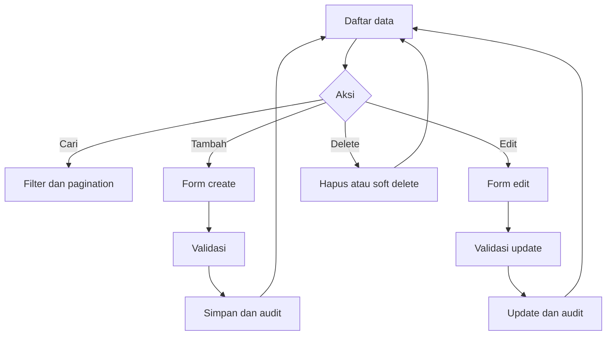

Catatan audit: cabang Edit saat ini terputus oleh `GAP-001`.

### 7.10 Template dan builder dokumen

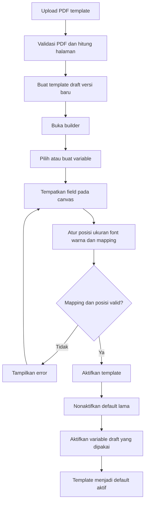

### 7.11 WhatsApp dan notification log

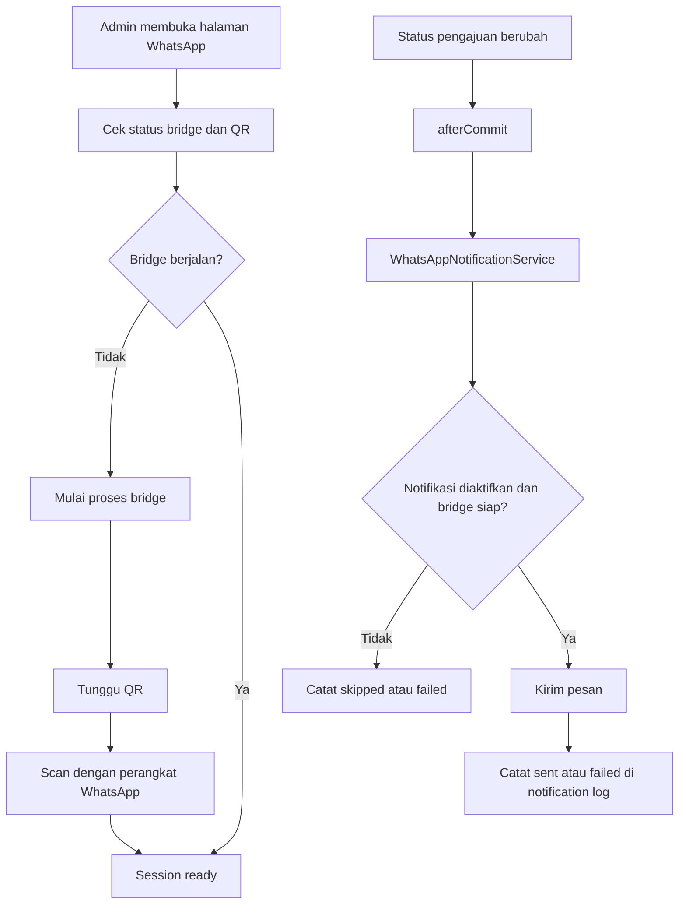

### 7.12 Observability, health, dan backup

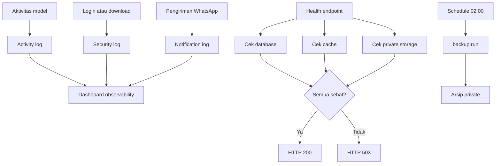

## 8. Prioritas penyelesaian

Urutan yang disarankan:

1. `GAP-001` — pulihkan seluruh halaman edit CRUD.
2. `GAP-002` — benarkan telepon nullable.
3. `GAP-003` — perbaiki detail pengajuan mobile.
4. `GAP-004` dan `GAP-005` — perbaiki tabel laptop.
5. `GAP-008` — masukkan build dan E2E kritis ke CI.
6. `GAP-006` dan `GAP-007` — benarkan manajemen role/permission dan input relasi.
7. `GAP-009` — isolasi filesystem test.
8. `GAP-010` sampai `GAP-016` — lengkapi integrasi eksternal, recovery, visual diff, accessibility, coverage, dan evaluasi bundle.

## 9. Checklist retest

Setelah sebuah gap diperbaiki:

1. ubah status menjadi `READY FOR RETEST`;
2. tambahkan regression test paling kecil yang mereproduksi masalah;
3. jalankan `php artisan test`;
4. jalankan `npm run build`;
5. reset database E2E terisolasi;
6. jalankan `npm run test:e2e:audit`;
7. bandingkan hasil dengan run `2026-08-06T12-49-18Z`;
8. isi resolution log; dan
9. ubah status menjadi `RESOLVED` hanya jika bukti retest lulus.

## 10. Resolution log

| Tanggal | Gap | Perubahan | Test/retest | Hasil | Catatan |
|---|---|---|---|---|---|
| — | — | — | — | — | Belum ada gap yang diselesaikan pada audit ini. |

## 11. Pertanyaan untuk keputusan produk

1. Apakah role harus mendukung permission granular dari UI atau hanya role bawaan?
2. Apakah nilai gender dan status perkawinan harus enum tetap atau configurable?
3. Apakah video memang harus diizinkan untuk semua persyaratan layanan dan dokumen final?
4. Siapa pemilik perangkat WhatsApp staging untuk E2E pairing?
5. Berapa lama dokumen, upload, notification log, dan security log harus disimpan?
6. Apakah visual baseline perlu menjadi blocking gate di pull request atau hanya laporan nightly?
